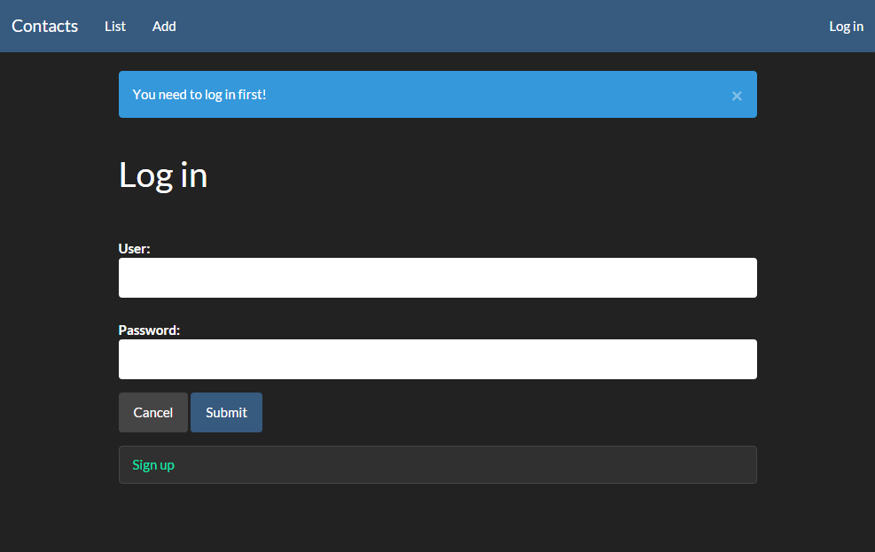

#Contacts

##Követelményanalízis
Alapvetően ezeket a dolgokat várjunk el a programtól:
* Lehessen új kontaktokat felvenni
* Lehessen a meglevő kontaktokat kilistázni
* Lehessen a meglévő kontaktokat szerkeszteni
* A felhasználók ne láthassák egymás kontaktjait
* Viszont a sajátjaikat igen
* A kontaktok ne vesszenek el (perzisztálva legyenek)
* Legyen biztonságos (nemregisztrált felhasználók ne okozhassanak kárt)
Valamint nem volt követelmény, de azért nem árt, hogy keresni is lehet a kontaktok között (név alapján).
##Tervezés
Az adatmodell a következőképpen néz ki

Mint látható **egy-sok** kapcsolatról van szó, egy felhasználónak több kontaktja lehet.
A design alapját a **bootswatch.com**-on elérhető ingyenes **css** állományok egyike képzi.

##Implementáció
##Tesztelés
##Felhasználói dokumentáció

