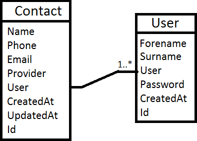
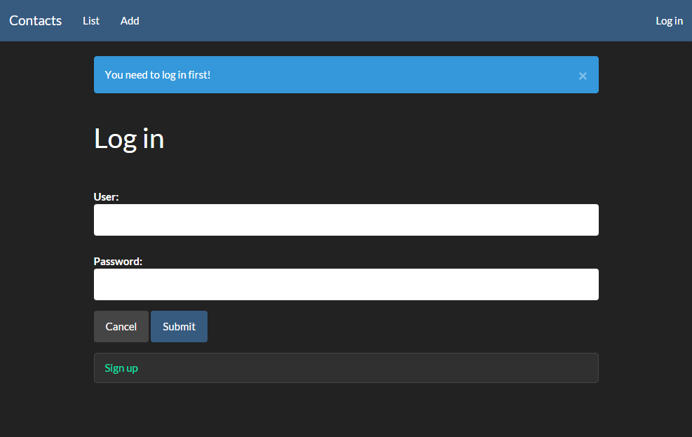
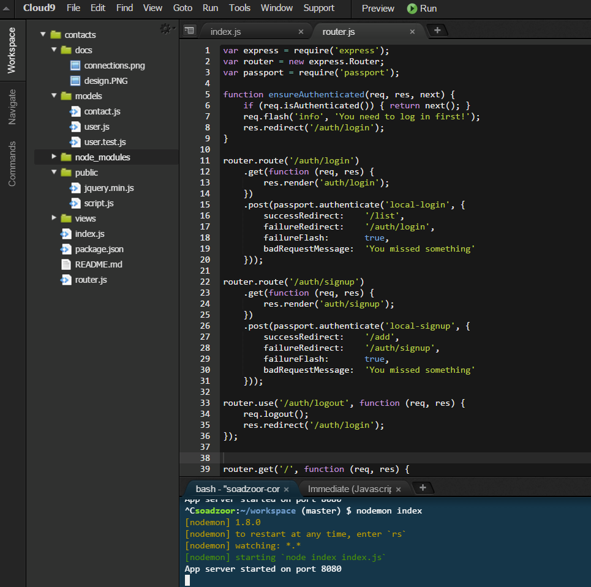

#Contacts

##Követelményanalízis
Alapvetően ezeket a dolgokat várjunk el a programtól:
* Lehessen új kontaktokat felvenni
* Lehessen a meglevő kontaktokat kilistázni
* Lehessen a meglévő kontaktokat szerkeszteni
* A felhasználók ne láthassák egymás kontaktjait
* Viszont a sajátjaikat igen
* A kontaktok ne vesszenek el (perzisztálva legyenek)
* Legyen biztonságos (nemregisztrált felhasználók ne okozhassanak kárt)
Valamint nem volt követelmény, de azért nem árt, hogy keresni is lehet a kontaktok között (név alapján).

##Tervezés
Az adatmodell a következőképpen néz ki

Mint látható **egy-sok** kapcsolatról van szó, egy felhasználónak több kontaktja lehet.
A design alapját a **bootswatch.com**-on elérhető ingyenes **css** állományok egyike képzi.

##Implementáció
A feladat a **cloud9** nevű online IDE-ben készült el, melynek címe **http://c9.io**. 
Teljes értékű fejlesztői felületről van szó, sok nyelvet támogat, és webszervert is képes közvetlenül futtatni, nem utolsó sorban teljesen ingyenes (verziója is van). Fejlesztés közben egy ubuntu rendszer támogat minket a háttérből, mellyel közvetlenül tudunk kommunikálni a megnyitott terminálon keresztül.

A könyvtárstruktúrában lévő mappák funkciói:
* docs -> ebben találhatók a dokumentációval kapcsolatos képek
* models -> a már említett modellek helye (contact, user)
* node_modules -> az **npm install** kezdetű parancsokkal telepített modulokat tartalmazza
* public -> jquery
* views -> a handlebars típusú generáló állományokat, illetve az authentikációhoz szükséges felületeket tartalmazza
* (root) -> a különböző metódusok definiálását/részletezését tartalmazó állományok helye

##Tesztelés
Létrehoztam két különbőző felhasználót, és hozzáadtam néhány kontaktot mindkettőhöz. Ezek után mindenfélét csináltam a kontaktokkal:
* töröltem őket
* szerkesztettem őket
* rájuk kerestem
Nem volt ám mindig minden jó, de minden hibát, amit észrevettem, javítottam. Egy automatikus teszt fájl is van a **models** mappában.

##Felhasználói dokumentáció

###Futtatáshoz ajánlott hardver- és szoftverkonfiguráció
Egyedül egy böngésző szükséges a programhoz, ne legyen túl régi. Ha az elmúlt pár évben frissítetted a böngészőt, akkor egész biztosan működni fog. Egy kifejezetten gyenge gépen is jól illene menni a programnak, mivel a lényegi részek szerveren futnak, a kliensoldalon szinte csak a megjelenítés van. Akár egy böngészőt futtatni képes telefon is elbírja.

###A program használata
Az alkalmazás elérhető a következő webhelyen: **https://soadzoorcontacts.herokuapp.com/**
Ha még nem regisztráltál, menj rá hogy **login**, vagy **list**, vagy **add**, majd alul a **sign up** gombra. Add meg az adataidat. A jelszót jól jegyezd meg, mert egyelőre nincs emlékeztetőfunkció, így ha egyszer elfelejted, akkor azzal a felhasználóval már soha többé nem tudsz bejelentkezni. 
A jelszavak titkosítva vannak, így azt én magam sem látom, nem tudok semmi ilyesmiben segíteni. 
Mondjuk az adatbázishoz hozzáférek, így a kontaktjaidat el tudom küldeni, ha szükség lenne rá, de azokat neked egyesével hozzá kell adni mégegyszer egy új felhasználót használva. Egyszerűbb, ha megjegyzed a jelszót.

###Telepítés lépései
Ha saját magad akarsz belenézni a kódba, nyugodtan megteheted a github oldalról. Akár le is töltheted egy nagy zip-ként, amit kicsomagolva hozzáférsz mindenhez. Npm szükséges a futtatáshoz mindenképpen, illetve a megfelelő modulokat is telepíteni kell
